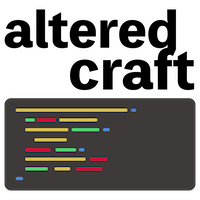

**AlteredCraft: Deep technical dives. Human-centered guidance. Your craft, evolved.**

## 🎯 What You'll Find Here

Each repository typically corresponds to a deep dive article exploring how AI is transforming specific aspects of software development:

> Every repository here is a working proof-of-concept from our Substack deep dives.
> We keep this examples simple but practical, not toy examples. No hand-waving. Just clean, practical code showing what's actually possible and giving you a good foundation to build upon.

## 📬 Subscribe to AlteredCraft
Get the full story behind each implementation, plus exclusive deep dives on navigating AI's disruption of software development.

**[→ Subscribe on Substack](https://alteredcraft.substack.com)**

---

**Built by [Sam Keen](www.linkedin.com/in/samkeen)** • AWS Technical Architect • Author of [Clean Architecture with Python](https://www.amazon.com/Clean-Architecture-Python-maintainable-architectural/dp/183664289X) • Founder of [Portland AI Engineers](https://www.portlandai.engineer/)
